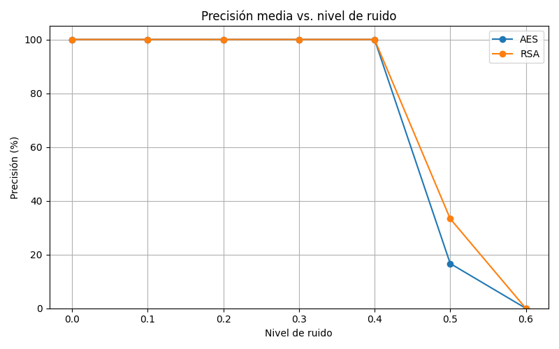

# 🧠🔐 Neurocipher


**Neurocipher** es un proyecto de investigación y desarrollo en criptografía aplicada y ciberseguridad, combinando herramientas clásicas como RSA con técnicas modernas como el cifrado simétrico (AES/Fernet), con el objetivo de explorar su integración futura con redes neuronales y sistemas adaptativos.

---

## 📌 Fases del proyecto

### Fase 1 — Criptografía Asimétrica (RSA básico)

- Implementación manual de funciones clave: `gcd()`, `modinv()`, `generate_keys()`, `encrypt_message()`, `decrypt_message()`.
- Pruebas unitarias completas.
- Documentación detallada con guía en PDF incluida.

### Fase 2 — Criptografía Simétrica (Fernet)

- Cifrado y descifrado de mensajes y archivos `.txt`.
- Uso de claves simétricas generadas de forma segura.
- Demos ejecutables y pruebas.

### Fase 3 — Criptografía con Curvas Elípticas (ECC) y Firma Digital (ECDSA)

- Implementación propia de curvas elípticas y operaciones de grupo.
- Generación de claves ECC.
- Firma y verificación digital con ECDSA.
- Cálculo dinámico del orden del punto generador.
- Documentación matemática y código con pruebas.

### Fase 4 — Redes de Hopfield para recuperación de claves (v1.0 a v1.3-A)

- **v1.0**: Red Hopfield básica entrenada con una sola clave.
- **v1.1**: Soporte para múltiples patrones (entrenamiento con 3 claves simultáneas).
- **v1.2**: Preentrenamiento mediante annealing (ruido decreciente) para mejorar la generalización.
- **v1.3-A**: Entrenamiento reforzado con patrones ruidosos + repeticiones + actualización en bloques. Alta robustez incluso con ruido del 25–50 %.
- Resultados almacenados en CSV y graficados con scripts en `graficos/`.
- Documentación detallada en LaTeX (`guia_hopfield.tex`).

### Fase 5 — Validación funcional con cifrado real
- Flujo completo: generación de clave → cifrado → red Hopfield → recuperación → descifrado del mensaje original.
- Pruebas reales con múltiples mensajes y niveles de ruido.
- Resultados visualizados mediante gráficos (`graficos/precision_vs_ruido.png`).
- Script principal: `src/secure_message.py`.

---

## 📂 Estructura del proyecto

```
neurocipher/
│
├── src/                     # Código fuente principal
│ ├── rsa_basic.py
│ ├── symmetric_encrypt.py
│ ├── elliptic_curve.py
│ ├── Hopfield_net.py
│ ├── secure_key_utils.py
│ └── secure_message.py
│
├── tests/                   # Tests unitarios y verificación
│
├── demos/                   # Demos ejecutables
│
├── graficos/                # Scripts y resultados gráficos
│
├── logs/                    # Resultados en CSV de recuperación Hopfield
│
├── keys/                    # Archivos de claves generadas
│
├── examples/                # Archivos de ejemplo
│
├── docs/                    # Documentación LaTeX y guías
│
├── guia_neurocipher.pdf     # Guía general del proyecto
├── guia_hopfield.tex        # Documento LaTeX sobre redes de Hopfield
├── checklist.docx           # Planificación por fases
├── requirements.txt
└── README.md
```

---

## 🛠️ Instalación

```bash
git clone https://github.com/tuusuario/neurocipher.git
cd neurocipher
pip install -r requirements.txt
```

---

## 🚀 Uso rápido

```bash
# Ejemplo: ejecutar la demo de cifrado de mensajes
python demos/demo_symmetric.py

# Ejemplo: cifrar y descifrar archivo de texto
python demos/demo_file_encryption.py
```

---

## 🧪 Ejecutar tests

```bash
make test
```

---

---

## 📘 Guía de uso paso a paso

1. Ejecuta el script principal del sistema completo:

-python src/secure_message.py


2. Este script realiza de forma automática:

- La generación de una clave AES o RSA.
- El cifrado de un mensaje de prueba.
- La conversión binaria de la clave y su almacenamiento en la red de Hopfield.
- La simulación de ruido en la clave (desde 0 % hasta 60 %).
- La recuperación de la clave original desde la red Hopfield.
- El intento de descifrado con la clave recuperada.
- La evaluación del éxito (¿se recuperó correctamente el mensaje?).

3. Los resultados del experimento se guardan automáticamente en:

- 📁 `logs/`: archivo CSV con precisión, nivel de ruido y éxito de descifrado.
- 📁 `graficos/`: gráfico generado `precision_vs_ruido.png` para visualizar el rendimiento.

4. Puedes personalizar fácilmente los mensajes modificando las líneas correspondientes dentro de `src/secure_message.py`. Se incluyen varios mensajes de prueba (con símbolos, acentos, texto largo...).

---

## 📈 Ejemplo visual del rendimiento

La siguiente gráfica muestra cómo la red de Hopfield (versión 1.3-A) recupera claves incluso con ruido del 40–50 %:



Este gráfico se genera automáticamente tras ejecutar el script `secure_message.py`.


---

## ⚠️ Notas

- Las claves utilizadas son generadas al vuelo y están pensadas únicamente para fines de prueba. No representan datos sensibles ni claves reales.
- Este sistema tiene carácter experimental y educativo, y **no debe usarse aún en entornos de producción real**.
- La recuperación exitosa depende del tipo de clave, del nivel de ruido y de la configuración de la red Hopfield (versión 1.3-A en este caso).


---

## 📊 Resultados y documentación

- Todos los experimentos realizados con la red de Hopfield se documentan en `logs/` (CSV).
- Los gráficos generados se encuentran en `graficos/`.
- Las guías teóricas y matemáticas están en `docs/` y en formato `.tex` y `.pdf`.

---

## 📈 Mejora continua

Este proyecto está en desarrollo activo. Se añadirán nuevas funcionalidades, integraciones y mejoras documentadas próximamente. El objetivo es seguir combinando técnicas criptográficas con redes neuronales para evaluar su aplicabilidad en sistemas reales.

---


---

## 📄 Licencia

Este proyecto se distribuye bajo la **Licencia Apache 2.0**.
