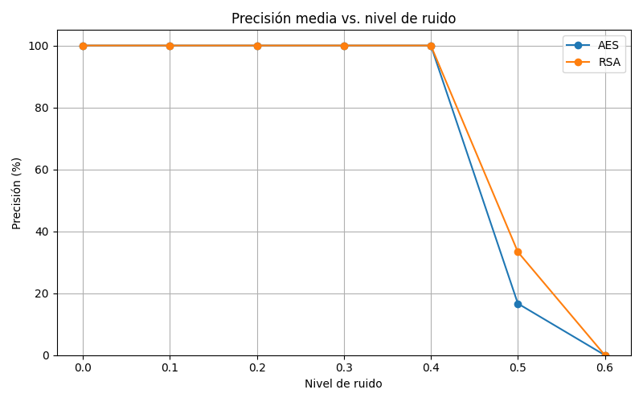

# 🧠🔐 Neurocipher


**Neurocipher** is a research and development project in applied cryptography and cybersecurity, combining classical tools like RSA with modern techniques such as symmetric encryption (AES/Fernet), aiming to explore future integration with neural networks and adaptive systems.

---

## 📌 Project Phases

### Phase 1 — Asymmetric Cryptography (Basic RSA)

- Manual implementation of key functions: `gcd()`, `modinv()`, `generate_keys()`, `encrypt_message()`, `decrypt_message()`.
- Complete unit testing.
- Detailed documentation with an included PDF guide.

### Phase 2 — Symmetric Cryptography (Fernet)

- Encryption and decryption of messages and `.txt` files.
- Securely generated symmetric keys.
- Executable demos and tests.

### Phase 3 — Elliptic Curve Cryptography (ECC) and Digital Signature (ECDSA)

- Custom implementation of elliptic curves and group operations.
- ECC key generation.
- Digital signing and verification with ECDSA.
- Dynamic calculation of the generator point order.
- Mathematical documentation and tested code.

### Phase 4 — Hopfield Networks for Key Recovery (v1.0 to v1.3-A)

- **v1.0**: Basic Hopfield network trained with a single key.
- **v1.1**: Support for multiple patterns (training with 3 keys simultaneously).
- **v1.2**: Pretraining using annealing (decreasing noise) to improve generalization.
- **v1.3-A**: Enhanced training with noisy patterns + repetitions + chunked updates. High robustness even with 25–50% noise.
- Results stored in CSV and visualized with scripts in `graficos/`.
- Detailed LaTeX documentation (`guia_hopfield.tex`).

### Phase 5 — Functional Validation with Real Encryption

- Full pipeline: key generation → encryption → Hopfield network → recovery → original message decryption.
- Real tests with various messages and noise levels.
- Results visualized via charts (`graficos/precision_vs_ruido.png`).
- Main script: `src/secure_message.py`.

---

## 📂 Project Structure

```
neurocipher/
│
├── src/                     # Main source code
│ ├── rsa_basic.py
│ ├── symmetric_encrypt.py
│ ├── elliptic_curve.py
│ ├── Hopfield_net.py
│ ├── secure_key_utils.py
│ └── secure_message.py
│
├── tests/                   # Unit tests and verification
│
├── demos/                   # Executable demos
│
├── graficos/                # Scripts and chart results
│
├── logs/                    # Hopfield recovery CSV results
│
├── keys/                    # Generated key files
│
├── examples/                # Example files
│
├── docs/                    # LaTeX documentation and guides
│
├── guia_neurocipher.pdf     # General project guide
├── guia_hopfield.tex        # Hopfield networks LaTeX doc
├── checklist.docx           # Phase planning
├── requirements.txt
└── README.md
```

---

## 🛠️ Installation

```bash
git clone https://github.com/tuusuario/neurocipher.git
cd neurocipher
pip install -r requirements.txt
```

---

## 🚀 Quick Usage

```bash
# Example: run message encryption demo
python demos/demo_symmetric.py

# Example: encrypt and decrypt a text file
python demos/demo_file_encryption.py
```

---

## 🧪 Run Tests

```bash
make test
```

---

## 📘 Step-by-step Usage Guide

1. Run the main script for the full system:

```bash
python src/secure_message.py
```

2. This script automatically performs:

- AES or RSA key generation.
- Test message encryption.
- Binary conversion and storage of the key in the Hopfield network.
- Noise simulation in the key (0% to 60%).
- Recovery of the original key from the Hopfield network.
- Decryption attempt with the recovered key.
- Evaluation of success (was the message recovered correctly?).

3. Experiment results are automatically saved in:

- 📁 `logs/`: CSV with precision, noise level and decryption success.
- 📁 `graficos/`: generated `precision_vs_ruido.png` graph for performance visualization.

4. You can easily customize messages by modifying the corresponding lines in `src/secure_message.py`. Several test messages are included (with symbols, accents, long text...).

---

## 📈 Visual Performance Example

The following chart shows how the Hopfield network (version 1.3-A) can recover keys even with 40–50% noise:



This graph is automatically generated after running the `secure_message.py` script.

---

## ⚠️ Notes

- Keys used are generated on-the-fly and are meant for testing purposes only. They do not represent real or sensitive data.
- This system is experimental and educational in nature and **should not yet be used in real production environments**.
- Recovery success depends on key type, noise level, and Hopfield network configuration (version 1.3-A in this case).

---

## 📊 Results and Documentation

- All Hopfield network experiments are logged in `logs/` (CSV).
- Generated charts are located in `graficos/`.
- Theoretical and mathematical guides are in `docs/` in `.tex` and `.pdf` format.

---

## 📈 Ongoing Improvement

This project is under active development. New features, integrations and documented improvements will be added soon. The goal is to continue combining cryptographic techniques with neural networks to evaluate their applicability in real systems.

---

## 📄 License

This project is distributed under the **Apache 2.0 License**.
